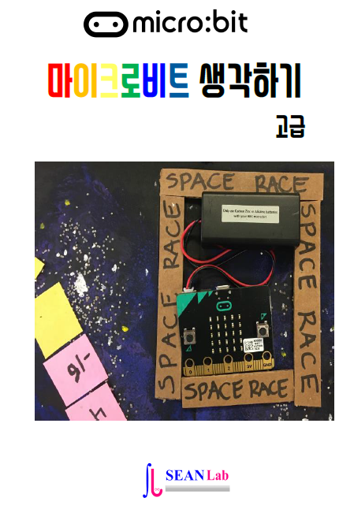

.. sphinxtemp2 documentation master file, created by
   sphinx-quickstart on Sat Nov 10 18:39:39 2018.
   You can adapt this file completely to your liking, but it should at least
   contain the root `toctree` directive.

Mighty Microbit Advanced
=======================================

 Mighty Microbit Advanced Lessons for Advanced

      written by sean base on following books

.. image:: ./img/chapter0_4.png

.. toctree::
   :maxdepth: 4

   ./lessons/prank-wifi
   ./lessons/speed-button
   ./lessons/headbands
   ./lessons/hero
   ./lessons/catch-the-egg-game

